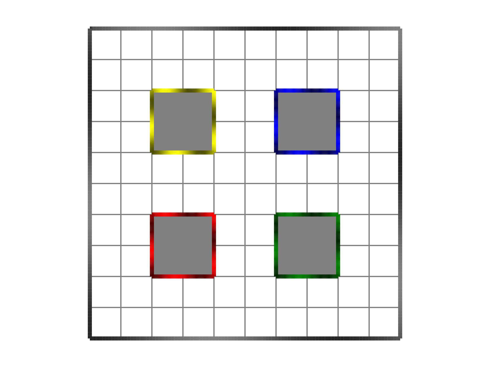

# Install

## Using conda

```bash
conda create -y -n trialstructs
conda activate trialstructs
conda install pip
pip install git+https://github.com/grero/RNNTrialStructures.py.git 
```
Note: Because of a change in how juliaup installs julia on macOS, you will get an error in the last line. A temporary fix is to create a symlink in the directory of the julia installation so that pyjuliapkg can find the julia executable. For instance,

```bash
cd $HOME/.julia/juliaup/julia-1.11.9+0.aarch64.apple.darwin14
ln -sf Julia-1.11.app/Contents/Resources/julia/bin .
```

# Usage

Create a navigation trial structure where each trial has between 20 and 50 time steps, using distance and head direction as inputs and position as output. Then,
create a batch_generator to return 500 trials of input `x`, output `y` and mask `w`. 
```python
>>> import RNNTrialStructures
>>> trialstruct = RNNTrialStructures.get_navigation_trialstruct(20,50, ["distance","head_direction"],["position"])
>>> batch_generator = RNNTrialStructures.get_batch_generator(trialstruct, 500)
>>> x,y,w = batch_generator()
```

The mask is mainly relevant for selecting the valid time steps for a trial when computing the cost function, e.g.

```python
import numpy as np
q = np.multiply(w, y).sum(1)
```
would only include valid time steps.

We can also create a trial structure where the output is the conjunction of position and gaze. To reduce the dimensionality of the conjunction output,
we'll use a binsize of 2 units for the floor of the arena, and 5 units for the walls. This will result in a conjunction dimension of 504.

```python
>>> import RNNTrialStructures
>>> trialstruct = RNNTrialStructures.get_navigation_trialstruct(20,50, ["distance","movement","texture"],["conjunction"])
>>> batch_generator = RNNTrialStructures.get_batch_generator(trialstruct, 500,binsize=2.0, binsize_wall=5.0)
>>> x,y,w = batch_generator()
```


Layout of the default 4 pillar arena.
